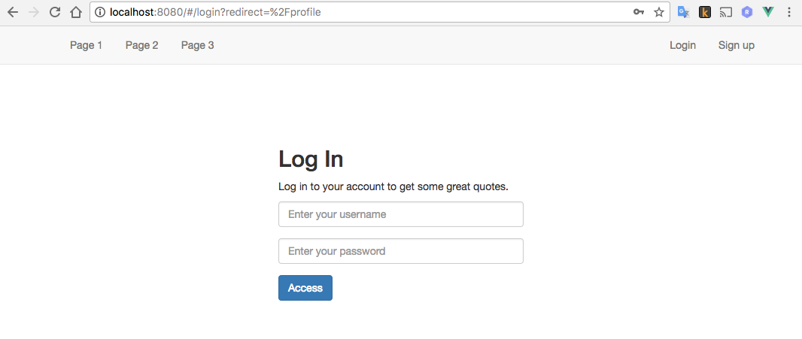
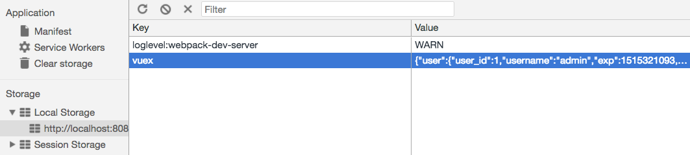

## drf-vue-jwt-example

This is an example for starting a single page application separating frontend and backend. Backend is built by Django REST framework (DRF), frontend is built by Vue.  The JSON Web Token (JWT) is for auth.

### Some Notes

#### Backend

* Custom user model by AbstractUser
* Custom permissions by BasePermission
* Handle sensitive fields when using Generic view
  * Scenario: Password filed can be used while saving user profile, cannot be shown while displaying user profile
  * Solution: Using write or read argument in ModelSerializer
* JWT setting

#### Frontend

* Handle all requests by axios interceptors
  * Redirect when token expired or no login 
* Handle JWT with Vuex to store states
* Save states into local storage

### Screenshot

Redirect

Save states into local storage

